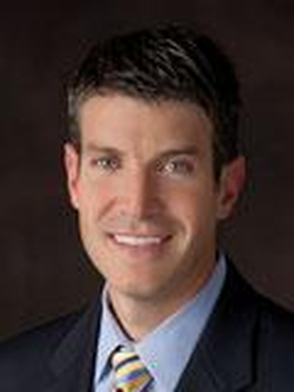

# MACH-I Website Revision Plan — Dr. D Feedback Sprint

**Created:** 2026-03-03
**PM:** Elon
**Status:** READY FOR EXECUTION
**Source:** Dr. D's "Web Site changes.docx" + Scott's feedback summary
**Branch:** `revisions/dr-d-feedback-round-1` (create from `main`)

---

## Pre-Sprint Setup

Before Phase 1 begins:
1. Create branch `revisions/dr-d-feedback-round-1` from `main`
2. Copy headshot `feedback/7c212048-d320-4e0a-b90e-76b1e2420bc9.jpg` to `img/dr-davenport-headshot.jpg`
3. Assess `feedback/We made LOGO on DOOR of OFFICE.PNG` — if it's a photo of a logo on a door, note it for Scott (may need design extraction). Do NOT use it as-is without Scott's input.

---

## DECISION NEEDED FROM SCOTT

**Contact page hours:** Dr. D actually works evenings after 5pm Mon-Fri and some Saturdays. But showing 8-5 virtually may be better (he can check emails all day). Options:
- A) Keep "8:00 AM - 5:00 PM Mon-Fri" as-is (virtual availability)
- B) Show "Available by appointment — evenings and Saturdays" (actual availability)
- C) Show "Inquiries: Mon-Fri 8am-5pm | Appointments: Evenings & Saturdays by arrangement"
- **Default if no answer by execution time:** Keep current 8-5 (option A). It's what Dr. D suggested as viable.

---

## Phase 1: Global Removals — Dr. Young & Pulmonary

**Agent:** Woz (structural changes across multiple files)
**Priority:** P0 — blocks everything else; content referring to removed items must go first
**Files owned:** `about.html`, `services.html`, `special-issuance.html`, `js/main.js`, `index.html`, `contact.html`, `intake.html`

### Changes

#### about.html
1. **Remove Dr. Young profile entirely** — delete the entire `<!-- Dr. Young Profile -->` block (lines 109-146)
2. **Update page hero** — change "Our Team" label and the "both physicians" headline/subtitle. New:
   - Section label: "About Dr. Davenport"
   - H1: "The FAA's Cardiovascular Specialist — Board-Certified Cardiologist, Military Flight Surgeon, and Licensed Pilot"
   - Subtitle: remove "That's not marketing. It's simply true."
3. **Update meta description** — remove "Dr. Adam Young" and "both physicians" references
4. **Update OG tags** — same removal
5. **Update mission section** — rewrite to remove "cardiologists and pulmonologists" and "Dr. Davenport and Dr. Young" references. Replace with solo Dr. D language. Remove "treats your heart or lungs" — change to "treats your heart"

#### services.html
1. **Remove entire pulmonary section** — delete `<section id="pulmonary">` block (the Aviation Pulmonology Services section)
2. **Remove "Pulmonary" nav pill** — from the services-nav-pills div, delete `<a href="#pulmonary" class="pill">Pulmonary</a>`
3. **Update meta description** — remove "pulmonology" reference
4. **Update page hero subtitle** — remove pulmonology mention if present
5. **Add HTML comment where pulmonary section was:** `<!-- REMOVED: Pulmonary services section. Save for re-addition when Dr. Young joins. -->`

#### special-issuance.html
1. **Remove "Beyond Cardiac" section** that references Dr. Young and pulmonary services (the section around line 842 mentioning "Dr. Alan Young" — note: first name is wrong, it says "Alan" not "Adam")
2. **Update "hundreds" to "thousands"** in hero subtitle: "Dr. Davenport has guided thousands of pilots"
3. **Update OG description** — "hundreds" to "thousands"

#### index.html
1. **Update CTA banner** — change "helped hundreds of pilots" to "helped thousands of pilots"
2. **Update schema.org JSON-LD** — remove "Pulmonology" from medicalSpecialty array

#### contact.html
1. **Remove "Aviation Pulmonology Consultation" from service dropdown** (line 83)

#### intake.html
1. **Remove or update pulmonary references in the intake form** — change "Pulmonary condition" option to something generic or remove it. Change "No cardiac/pulmonary condition" to "No cardiac condition (other service)"

#### js/main.js
1. **Remove pulmonary link from footer** — delete the `'<li><a href="services.html#pulmonary">Pulmonology</a></li>'` line from buildFooter()
2. **Remove "Eddie Review" nav link** — delete `'<li><a href="eddie-review-checklist.html" class="nav-review-link">Eddie Review</a></li>'` from buildHeader()
3. **Update footer hours** if Scott decides to change them (defer to Phase 5 if decision pending)

### Gate Criteria
- [ ] Zero references to "Dr. Young", "Adam Young", "Dr. Alan Young" anywhere in served HTML files
- [ ] Zero references to "pulmonary", "pulmonology", "Pulmonologist" in served HTML files (except the saved HTML comment)
- [ ] "Eddie Review" nav link removed
- [ ] Schema.org JSON-LD updated
- [ ] All nav pills, dropdowns, footer links cleaned
- [ ] Site loads without JS errors in browser console
- [ ] All pages render (no broken layouts from removed sections)

### Commit message
`Remove Dr. Young and all pulmonary references per client feedback`

---

## Phase 2: Home Page Content Updates

**Agent:** Rod (copy/messaging specialist)
**Priority:** P1
**Files owned:** `index.html`

### Changes

1. **"Denied or Deferred?" card** — Replace:
   - OLD: `"Your AME couldn't issue your medical. You need a specialist who speaks the FAA's language — because Dr. D literally wrote it."`
   - NEW: `"Your AME couldn't issue your medical. You need a specialist who speaks the FAA's language — and teaches most AME courses and refresher courses for the FAA."`
   - Rationale: Dr. D was involved in cardiology sections but didn't write the AME guidelines. He teaches most AME courses/refresher courses.

2. **"Peak Performance?" card** — Generalize beyond pilots:
   - OLD: `"Executive health screening and human performance optimization for pilots who want to fly longer, safer, and sharper."`
   - NEW: `"Comprehensive cardiovascular evaluation and performance optimization — for pilots, executives, and anyone who demands peak health and wants to stay ahead of disease."`
   - Rationale: Dr. D has taken care of every USAF pilot with CAD since 2008, but the lessons apply to prevention and optimization for everyone.

3. **Under "Clinical Excellence" credential** — add Internal Medicine:
   - OLD: `"Board Certified Cardiology, FACC, Invasive & Nuclear Qualified"`
   - NEW: `"Board Certified Internal Medicine & Cardiology, FACC, Invasive & Nuclear Qualified"`

4. **Under "Professional Recognition" credential** — add IAASM:
   - OLD: `"Fellow, Aerospace Medical Association (FAsMA) — Class of 2019"`
   - NEW: `"Fellow, Aerospace Medical Association (FAsMA) — Class of 2019. Academician, International Academy of Aviation & Space Medicine (IAASM) — Inducted 2018"`

5. **Under "International Leadership" credential** — fix NATO title:
   - OLD: `"Former Chairman NATO Aviation Cardiology Working Group, NATO S&T Award 2024"`
   - NEW: `"Former Deputy Chairman & Chairman, NATO Aviation Cardiology Working Group — authored/co-authored all 10 papers across 8 countries. NATO S&T Award 2024"`

6. **CTA banner "hundreds" already handled in Phase 1** — verify it says "thousands"

### Gate Criteria
- [ ] "Denied or Deferred" card no longer says "literally wrote it"
- [ ] "Peak Performance" card mentions more than just pilots
- [ ] Clinical Excellence includes Internal Medicine
- [ ] Professional Recognition includes IAASM 2018
- [ ] International Leadership reflects deputy chairman role and 10 papers/8 countries
- [ ] No broken HTML — all cards render correctly
- [ ] Text reads naturally (not stilted or overstuffed)

### Commit message
`Update home page content per Dr. D feedback — credentials, messaging, NATO role`

---

## Phase 3: About Page Bio Enhancement

**Agent:** Rod (copy/messaging — make Dr. D "sound cooler")
**Priority:** P1
**Files owned:** `about.html`

### Changes

1. **Add headshot image** — Replace the `<div class="dr-initials dr-initials--ed">ED</div>` placeholder with:
   ```html
   
   ```
   - Note: Woz or Jony may need to add CSS for `.dr-headshot` class. If no CSS exists, add inline sizing: `style="width: 120px; height: 120px; border-radius: 50%; object-fit: cover;"`

2. **Rewrite bio paragraphs** to integrate CV highlights and make him "sound cooler." Must include ALL of these facts:
   - Board-certified in Internal Medicine AND Cardiology
   - Fellow, American College of Cardiology (FACC)
   - Fellow, Aerospace Medical Association (FAsMA)
   - Academician, International Academy of Aviation & Space Medicine (IAASM) — inducted 2018
   - 100+ publications, author/co-author of 2 textbooks
   - Lectures in 8+ countries on 4 continents
   - Deployed to Afghanistan
   - Colonel (retired) USAF
   - 10,000+ procedures
   - NASA consultant, NATO consultant, FAA consultant
   - Only FAA cardiovascular consultant who ALSO consults for US military, NATO, and NASA
   - Every USAF cardiac aircrew waiver guide since 2009

3. **Fix NATO role** — change "led" to "served as deputy chairman and then chairman of":
   - He was DEPUTY chairman (not just chairman/leader)
   - He authored/co-authored all 10 papers
   - 8 countries across North America and Europe participated

4. **Update credentials section** — add to Clinical Excellence:
   - Add "Board Certified Internal Medicine" to the list

5. **Add to International Leadership credentials:**
   - Add "Academician, International Academy of Aviation & Space Medicine (IAASM) — 2018"
   - Fix NATO entry: "Former Deputy Chairman & Chairman, NATO Aviation Cardiology Working Group"
   - Add "NASA Aerospace Medicine Consultant"

6. **Bio tone:** Should read as accomplished but human. Not a CV dump. Lead with what makes him unique (only person consulting for FAA + military + NATO + NASA), then build the story — military service, Afghanistan deployment, clinical volume (10k+ procedures), research output, teaching across continents. End with why he does this — he's a pilot himself.

### Gate Criteria
- [ ] Headshot image displays correctly (not broken image icon)
- [ ] Bio contains all required facts from the list above
- [ ] NATO role says "deputy chairman" not just "chairman" or "leader"
- [ ] Internal Medicine board cert added to credentials
- [ ] IAASM inducted 2018 appears
- [ ] NASA consultant mentioned
- [ ] Bio reads naturally — not a CV bullet dump
- [ ] No broken layout from headshot insertion

### Commit message
`Enhance Dr. D about page bio with CV highlights, headshot, and credential updates`

---

## Phase 4: Services Page Revamp

**Agent:** Rod (copy/messaging) for content; Jony (design) if structural HTML changes needed
**Priority:** P1
**Files owned:** `services.html`

### Changes

#### 4A: Free Initial Consultation — Extend to ALL Services
1. Currently the free consultation card is under Aviation Medicine section only. Add a prominent note/badge to EVERY service card: "Free initial consultation available" or add a site-wide banner in the services intro.
2. Alternative: Add a callout box right after the services-nav-pills: "Every service begins with a free initial consultation. No obligation, no paperwork."

#### 4B: Special Issuance — Tone Down "FAA's own"
1. In the Special Issuance section, change:
   - OLD: `"managed by the FAA's own cardiovascular consultant"`
   - NEW: `"managed by one of approximately ten FAA cardiovascular consultants — and the only one who also consults for the U.S. military, NATO, and NASA"`

#### 4C: Human Performance Optimization — MAJOR REVAMP
1. **Remove from current "Human Performance Optimization" card:**
   - Cognitive performance testing
   - Sleep and fatigue analysis
   - Altitude and G-tolerance optimization

2. **Reframe the Executive Health & Human Performance section.** New concept: Executive Cardiovascular Evaluation comparable to Mayo Clinic / Cleveland Clinic / Harvard programs.

3. **Rename section header:** "Executive Cardiovascular Evaluation & Human Performance" or similar

4. **New card: Executive Cardiovascular Evaluation** (replaces both current cards in this section):
   - **Price:** Contact for pricing (or keep $599 / $2,000 tiers if Scott prefers)
   - **Description:** A comprehensive cardiovascular assessment comparable to what you'd receive at Mayo Clinic, Cleveland Clinic, or Harvard — but conducted by the only physician in the country who is simultaneously an FAA cardiovascular consultant, NASA consultant, and NATO aerospace medicine expert.
   - **In-office testing includes:**
     - ECG (electrocardiogram)
     - Echocardiogram
     - Body composition analysis
     - Lipid panel & Hemoglobin A1c
     - Formal cardiopulmonary exercise testing — treadmill or cycle ergometer with gas exchange analysis (the same protocol used for NASA astronauts and elite athletes from the Olympics, NCAA, NFL, NBA, NHL, and MLB)
   - **Format:** 4-hour assessment, half-day commitment. Results reviewed with you before you leave.
   - **Value prop:** Most comparable programs charge over $10,000. (Do NOT state our price is lower unless Scott confirms — just note competitors charge 10k+)
   - **Target audience:** Executives, athletes, pilots, and anyone who wants the most thorough cardiovascular evaluation available.

5. **Remove the old Executive Health Screening card** and the old Human Performance Optimization card. Replace with the single new card described above.

#### 4D: Speaking & Consulting — Update with Engagements
1. Update the Speaking & Consulting card description to mention lectures in 8+ countries on 4 continents.
2. Add upcoming engagements list:
   - Garmisch, Germany — March 2026
   - Denver, CO — May 2026
   - Milan, Italy — May 2026
   - Istanbul, Turkey — October 2026
   - Australia/New Zealand — Fall 2026 (dates pending)
   - Cape Town, South Africa — October 2027 (dates pending)

### Gate Criteria
- [ ] Pulmonary section gone (Phase 1 handles this, but verify)
- [ ] Free consultation messaging applies to all services, not just aviation
- [ ] Special Issuance description reflects "one of ~10" not "the FAA's own"
- [ ] Human Performance section completely rewritten per spec above
- [ ] No mention of cognitive testing, sleep analysis, altitude/G-tolerance
- [ ] Cardiopulmonary testing with gas exchange is prominently described
- [ ] NASA/Olympic/pro sports comparison present
- [ ] "Most places charge over $10,000" value prop present
- [ ] Speaking engagements list includes all 6 upcoming events
- [ ] All service cards render correctly (no broken HTML)
- [ ] Nav pills still work (pulmonary removed, others intact)

### Commit message
`Revamp services page — executive cardio eval, speaking engagements, consultation updates`

---

## Phase 5: Special Issuance & Contact Page Updates

**Agent:** Rod (copy/messaging)
**Priority:** P1
**Files owned:** `special-issuance.html`, `contact.html`

### Changes

#### special-issuance.html

1. **"Do I have to come to Dayton?" FAQ** — Expand the answer to add CVG airport info. After the existing content about DAY airport, add a new paragraph:
   - Cincinnati/Northern Kentucky International Airport (CVG) is less than 50 miles away — featuring advanced security scanners, average TSA wait times under 5 minutes, excellent airline lounges, and rapidly expanding direct flight options. The Cincinnati area is also home to the Reds and Bengals, and the nearby Kentucky Bourbon Trail makes for a worthwhile side trip.

2. **Verify "hundreds" was changed to "thousands" in Phase 1** — hero subtitle

#### contact.html

1. **Add nearby airports** — In the travel-info section (currently mentions DAY and MGY), add:
   - Cincinnati/Northern Kentucky International Airport (CVG) — less than 50 miles
   - John Glenn Columbus International Airport (CMH) — approximately 70 miles

2. **Hours decision** — Apply Scott's decision from the DECISION NEEDED section above. If no decision yet, keep current "8:00 AM - 5:00 PM Mon-Fri" and add a note: "Virtual consultations available by appointment."

3. **Remove "Aviation Pulmonology Consultation" from service dropdown** (if not already done in Phase 1 — verify)

### Gate Criteria
- [ ] CVG airport info added to special-issuance FAQ with all specified details
- [ ] CVG and CMH airports added to contact page
- [ ] Hours reflect Scott's decision (or sensible default)
- [ ] No pulmonary references remain in dropdowns
- [ ] FAQ accordion still expands/collapses correctly
- [ ] Contact form still submits to Netlify

### Commit message
`Update special issuance FAQ and contact page — airports, travel info, hours`

---

## Phase 6: Site-Wide Cleanup & Consistency Pass

**Agent:** Woz (structural/technical)
**Priority:** P2
**Files owned:** ALL HTML files, `js/main.js`, `css/styles.css`

### Changes

1. **Verify NATO title consistency** across all pages — should say "Former Deputy Chairman & Chairman" or "Prior Chair" everywhere, not just on some pages
2. **Verify "thousands" (not "hundreds")** appears everywhere it should
3. **Verify Internal Medicine board cert** appears in all credential listings
4. **Verify IAASM** appears where credentials are listed
5. **Verify no orphaned links** — no links pointing to removed pulmonary section, no links to Dr. Young, no links to eddie-review-checklist.html
6. **Check all anchor links** — `#pulmonary` anchor links should be gone; all remaining `#` links should resolve
7. **Remove eddie-review-checklist.html and eddie-review-checklist.md** from served files (or add a redirect/404). These were internal review artifacts.
8. **Update `design-spec.md`** references to Dr. Young and pulmonary if it's a living doc (low priority — this is reference only)
9. **Add `.dr-headshot` CSS class** to `css/styles.css` if not already present:
   ```css
   .dr-headshot {
     width: 120px;
     height: 120px;
     border-radius: 50%;
     object-fit: cover;
     border: 3px solid var(--color-gold);
   }
   ```

### Gate Criteria
- [ ] `grep -ri "young" *.html` returns zero results (except saved comments)
- [ ] `grep -ri "pulmon" *.html` returns zero results (except saved comments)
- [ ] `grep -ri "hundreds" *.html` returns zero results
- [ ] NATO title consistent across all pages
- [ ] No broken anchor links
- [ ] No dead nav links
- [ ] CSS for headshot renders correctly
- [ ] eddie-review-checklist.html removed or hidden

### Commit message
`Site-wide consistency pass — verify all feedback changes, fix orphaned refs`

---

## Phase 7: Git Push & Deploy

**Agent:** Woz (or Haiku utility agent)
**Priority:** P0 (gate for Phase 8)
**Files owned:** git operations only

### Steps
1. Verify all 6 prior commits are clean on the `revisions/dr-d-feedback-round-1` branch
2. `git push -u origin revisions/dr-d-feedback-round-1`
3. Create PR to `main` with summary of all changes
4. If Scott approves (or instructs auto-merge): merge to `main`
5. Verify Netlify auto-deploys from `main` (or trigger manual deploy)
6. Confirm live site at production URL reflects all changes

### Gate Criteria
- [ ] All commits pushed
- [ ] PR created (or merged to main per Scott's instruction)
- [ ] Netlify deploy succeeds
- [ ] Live site loads without errors

### Commit message
N/A (merge commit)

---

## Phase 8: Full UI/UX Review & Responsive Testing

**Agent:** Jony (design/UX specialist)
**Priority:** P1
**Files owned:** NONE (read-only review). If fixes needed, Jony flags them and Woz/Rod fix.

### Scope

This is a comprehensive visual and functional review of every page AFTER all content changes are deployed. The goal is to catch anything broken by the content revisions.

#### 8A: Desktop Review (1440px+ viewport)
For EACH of these pages: `index.html`, `about.html`, `services.html`, `special-issuance.html`, `contact.html`, `publications.html`, `intake.html`, `thank-you.html`

1. **Visual scan** — Does the page look correct? Any overlapping text, broken images, misaligned sections?
2. **Content verification** — Do the changes from Phases 1-6 appear correctly?
3. **Navigation** — Header links all work, footer links all work, no dead links
4. **Interactive elements** — Accordion cards expand/collapse, form validation works, smooth scroll works
5. **Headshot** — Dr. D's photo renders correctly on about page, correct aspect ratio, no distortion

#### 8B: Tablet Review (768px viewport)
Same checks as 8A but at tablet width. Specifically watch for:
- Service cards stacking correctly
- Credential grids not overflowing
- Navigation menu responsive behavior
- Hero text not overflowing

#### 8C: Mobile Review (375px viewport)
Same checks as 8A but at mobile width. Specifically watch for:
- Hamburger menu works
- All text readable without horizontal scroll
- Cards stack to single column
- Form is usable on small screen
- CTA buttons are tap-target sized
- Headshot doesn't take up entire viewport

#### 8D: Cross-Functional Checks
1. **All links** — Click every link on every page. No 404s, no dead anchors.
2. **Contact form** — Submit a test form (or verify Netlify form detection)
3. **Intake form** — Verify dropdown options are updated (no pulmonary)
4. **Performance** — Pages load in reasonable time, no massive images blocking render
5. **Accessibility** — Page titles make sense, alt text on images, skip-to-content link works
6. **SEO** — Meta descriptions updated, no references to removed content in meta tags

### Deliverable
Jony produces a review report at `build-monitor/reports/ui-review-round-1.md` listing:
- Page-by-page status (PASS / FAIL with details)
- Screenshots of any issues found
- P-level for each issue (P1 = must fix, P2 = should fix, P3 = nice to have)

### Gate Criteria
- [ ] All 8 pages reviewed at all 3 viewport sizes
- [ ] Zero P1 issues remaining
- [ ] All links verified working
- [ ] Forms functional
- [ ] Review report written

### Commit message
If fixes needed: `Fix UI issues found in post-revision review`

---

## Phase 9: Final Deploy & Sign-Off

**Agent:** Woz
**Priority:** P0

1. Apply any fixes from Phase 8 review
2. Push to GitHub
3. Merge to main (if on branch)
4. Verify Netlify deploy
5. Final visual check of live production site
6. Update working-notes.md with completion status

### Gate Criteria
- [ ] Live site matches all Phase 8 review expectations
- [ ] Zero P1 issues
- [ ] working-notes.md updated
- [ ] Scott notified of completion

### Commit message
`Post-review fixes and final deploy — revision round 1 complete`

---

## File Ownership Map

| File | Phase 1 | Phase 2 | Phase 3 | Phase 4 | Phase 5 | Phase 6 |
|------|---------|---------|---------|---------|---------|---------|
| index.html | Woz | Rod | - | - | - | Woz |
| about.html | Woz | - | Rod | - | - | Woz |
| services.html | Woz | - | - | Rod/Jony | - | Woz |
| special-issuance.html | Woz | - | - | - | Rod | Woz |
| contact.html | Woz | - | - | - | Rod | Woz |
| intake.html | Woz | - | - | - | - | Woz |
| js/main.js | Woz | - | - | - | - | Woz |
| css/styles.css | - | - | - | - | - | Woz |
| publications.html | - | - | - | - | - | Woz |

**Rule:** Only one agent owns a file per phase. No overlaps within a phase.

---

## Non-Website Items (Deferred — DO NOT implement)

These came up in Dr. D's feedback but are out of scope for this sprint:
- New email without Gmail → separate project
- Encrypted inbox for medical records → separate project
- Testimonials system → future feature
- Netlify account purchase → Mac Studio setup sessions
- Fastmail vs Wix email decision → Mac Studio setup sessions
- Mac Studio and MacBook specs → already tracked in setup/ directory

---

## Parallelization Notes

- **Phase 1 must complete first** — all other phases depend on removals being done
- **Phases 2, 3, 4, 5 can run in parallel** — they own different files
- **Phase 6 runs after 2-5 complete** — it's the consistency pass
- **Phase 7 runs after 6** — push/deploy
- **Phase 8 runs after 7** — review requires deployed site
- **Phase 9 runs after 8** — final fixes

```
Phase 1 (removals)
    |
    +---> Phase 2 (home) ----+
    +---> Phase 3 (about) ---+
    +---> Phase 4 (services) -+---> Phase 6 (cleanup) --> Phase 7 (deploy) --> Phase 8 (UI review) --> Phase 9 (final)
    +---> Phase 5 (SI/contact)+
```

---

## Estimated Effort

| Phase | Agent | Model | Est. Context |
|-------|-------|-------|-------------|
| Setup | Haiku | haiku | Tiny — file copy + branch |
| Phase 1 | Woz | sonnet | Medium — 7 files, mechanical removals |
| Phase 2 | Rod | sonnet | Small — 1 file, copy edits |
| Phase 3 | Rod | sonnet | Medium — 1 file, bio rewrite |
| Phase 4 | Rod/Jony | sonnet | Large — 1 file, major content rewrite |
| Phase 5 | Rod | sonnet | Small — 2 files, targeted additions |
| Phase 6 | Woz | sonnet | Medium — multi-file grep + verify |
| Phase 7 | Haiku | haiku | Tiny — git operations |
| Phase 8 | Jony | sonnet/opus | Large — full site visual review |
| Phase 9 | Woz | sonnet | Small — fixes + deploy |

Total: ~10 agent dispatches, heavily parallelizable after Phase 1.
